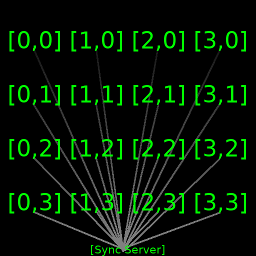

# Project Delta
A client program that runs the in the background which is capable of OpenGL graphics and OpenAL audio to be controlled by a central synchronization server for fun.

This generally is meant to run on the Windows Operating System, however it should be capable of running just fine on Debian & Ubuntu GNU/Linux as well.

## What is this?
This is a fun project I am creating for my CSIS 10A "final project".

Essentially you run this on a large group of computers and it will have them act like a botnet (sound familiar? *cough* Windows 10 *cough*) minus the malicious intentions!

All resources and media is kept client-side, such as audio files and images.

This client will be running initially on n number of machines which will each have a \[x\] and \[y\] coordinate assigned to them via CLI program parameters on launch. Eg: `java -jar client.jar 4,2` this means that computer is located physically at x=4 (columns) and y=2 (rows).

This will allow custom creations of synchronized textures and audio effects to be performed across a array of computers.

## How it works?
1. When the client is launched it is running in the background generally without an interface or console.
2. Assuming the client was able to successfully connect to the synchronization server, the client will keep the connection open waiting for the server to send back a play packet which will play whatever the server specified.
3. The client will then open a GLFW window fullscreen and attempt to prevent user-interrupt keys from closing the program while it is running.
4. Finally when the synchronization server decides to end the program they can specify for all the clients to self-delete themselves, or to simply quit the program and close the connection.

## Configuration
The `resources/client.conf` configuration file is used to determine what server to connect to. This file is packaged inside the compiled jar.
- `server` The server to use to synchronize with.
- `port` The synchronization server's port number.
